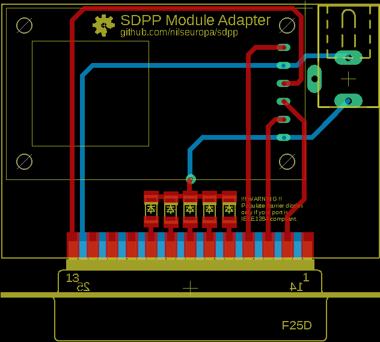
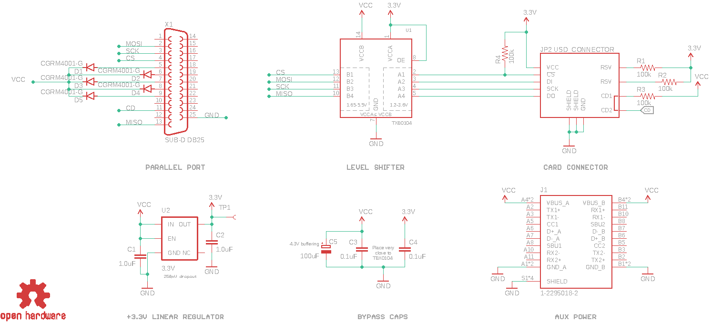

# SD Card to Parallel Port Adapter(s) and MS-DOS Driver

"A long forgotten solution that gets updated every decade or so. [ 1994 - 2014 - **2024** ]"
*It's either the update rate is doubling - and the next update will come in 2029 - or it is coming in every year that ends with a four...* Anyway, I wanted to have a single repository to contain all information to keep this neat solution afloat. This is it.


## Parallel port power
Current version of the MS-DOS driver supports [powering the SD card](https://www.transkommunikation.ch/dateien/schaltungen/diverse_schaltungen/computer_circuits/Get%20Power%20From%20Pc%20Parallel%20Port.pdf) via the parallel port. A modern micro SD card [takes around 25mA](
https://goughlui.com/2021/02/27/experiment-microsd-card-power-consumption-spi-performance/) of current on 3.3V in average. There are five data channels that are utilized as power outputs:

| Adapter | DB-25 Pin | Parallel Port |
| -------- | ------- | ------- |
| VCC | 5 | Data 3 |
| VCC | 6 | Data 4 |
| VCC | 7 | Data 5 |
| VCC | 8 | Data 6 |
| VCC | 9 | Data 7 |

*IEEE 1284 Level II interface drivers must be able to source 14 mA current (at least +2.4V
voltage) and also sink 14 mA current (output voltage lower than 0.4V). The output impedance
in normal operation range is defined to be 50+/-5 ohms.*

|Port type|Normal|UM82C11-C|IEEE 1284|
| -------- | -------- | ------- | ------- |
Data output (>2.4V)| 2.6 mA| 2 mA| 14 mA|
Data line sink (<0.4V)| 24 mA| 24 mA| 14 mA|
Control output (>2.4 V)| 0.5 mA| 1.5 mA| ?|
Signal lines (short circuit)| 1 mA| ?| ?|
Control line sink (<0.4V)| 7 mA| 7 mA| 14 mA|

:warning: **WARNING, using this feature can potentially harm your port driver if it is not IEEE1284 compliant!**

As this standard came alive in 1994, rule of thumb is that most computers built after it are probably compliant, and everything before that is a mystery that you have to solve for the sake of your machine.
The power feature is totally optional, and potentially dangerous if your machine doesn't support it.

# Hardware options

1. Hook up an SD breakout board to a DB25 and be done with it *( see Wiring )*
2. Etch my simple adapter board design for the breakout module
3. Build my SD Drive design *( contributions are welcome )*

## SD Breakout board
In principle any SD card connector breakout board can be used that has 3.3/5V level shifters and a voltage regulator - like this one:


:warning: **Do not use breakout boards without level shifters! You will most likely damage your card.**

### Wiring
| SD Adapter | Hint | DB-25 Pin | Parallel Port |
| -------- | ------- | ------- | ------- |
| CS |Chip select| 4 | Data 2 |
| SCK |Clock| 3 | Data 1 |
| MOSI |Card serial in| 2 | Data 0 |
| MISO |Card serial out| 13 | Select |
| VCC |**+5V DC**|   |  |
| GND |Ground| 25 | Ground |
| **Optional** |  | |
| CD |Card detect| 11 | BUSY|

## Breakout Adapter

### Schematic diagram
Disregard the barrier diodes in case you want to build a fool-proof circuit.


### Etch it yourself at home board
This is an easy to fabricate adapter board for the micro SD card connector breakout module depicted above. It is available through at least 5 vendors. *( The one I have came from Reichelt. )*



**Double check that your port is IEEE1284 compliant.**
The circuit also provides an auxiliary power input through barrel jack connector. In case you are unsure or your port is unable to handle the load **DO NOT POPULATE** the barrier diodes!

## SD Drive *( the fancy )*
Or a more integrated version, designed to power the SD card through an IEEE1284 compliant port.

### Schematic diagram

Each channel is fed through a super low forward drop *(0.31V)* barrier diode to protect the port in case the push-pull outputs are operated by another software than the MS-DOS driver in this repository. The sum of the channels is buffered by a 100uF capacitor, and the supply voltage for the SD card is provided by a linear regulator. With the correct port type, this provides around 100mA on the 3.3V rail that can handle the microsecond long spikes that occur during flash write cycles.




### Board layout

**Double check that your port is IEEE1284 compliant.**
The circuit also provides an auxiliary power input through a USB-C connector. In case you are unsure or your port is unable to handle the load **DO NOT POPULATE** the barrier diodes!


#### Bill of materials
```
Part     Value          Package             Type

C1       1.0uF          0603-CAP
C2       1.0uF          0603-CAP
C3       0.1uF          0603-CAP
C4       0.1uF          0603-CAP
C5       100uF          PANASONIC_C
D1       CGRM4001-G     SOD-123_MINI-SMA   RB521ASA
D2       CGRM4001-G     SOD-123_MINI-SMA   RB521ASA
D3       CGRM4001-G     SOD-123_MINI-SMA   RB521ASA
D4       CGRM4001-G     SOD-123_MINI-SMA   RB521ASA
D5       CGRM4001-G     SOD-123_MINI-SMARB521ASA
J1       1-2295018-2    TE_1-2295018-2     USB-C
JP2      USD_CONNECTOR  MICRO-SD-SOCKET-PP 4UCON-15882
R1       100k           0603-RES
R2       100k           0603-RES
R3       100k           0603-RES
R4       100k           0603-RES
U1       IC1            SO14               TXB0104PWRSOIC14
U2       3.3V           SOT23-5            V_REG_AP2112K-3.3V
X1       SUB-D DB25     F25D
```

:exclamation: This printed circuit board is yet to be tested. If you have built one, please let me know.

****

# MS-DOS Device Driver
Original device driver is written in 1994 by **Dan Marks** and it is based on TU58 by **Robert Armstrong**. Foolproof MMCv3/SDv1/SDv2 control module from Chan Fat FS has been added by [profdc9](https://forum.vcfed.org/index.php?threads/ms-dos-driver-for-an-sd-card-connected-via-a-parallel-port.41516/) and posted on Vintage Computer Federation forum in 2014.

The driver is made available under the GNU General Public License version 2 and incorporates modified code from ELM Chan Fat FS: http://elm-chan.org/fsw/ff/00index_e.html.

#### Compilation
If you would like to compile the driver from source you'll need **Borland C++ 3.1** with the included **Turbo Assembler 3.1** installed on your DOS machine.

### Binaries

:floppy_disk: [Download](driver/SD.SYS) the latest pre-compiled version of `SD.SYS`

:floppy_disk: [Download](driver/NILQUAD.SYS) a modified version compiled for Nilquader's NC100 SD adapter `NILQUAD.SYS` *(MISO on BUSY)*

****

## How to use it

* Create <=32MB partition(s) on a uSD card
* Format to FAT16 for best results
* Find out the port base of your parallel port
* Make sure that you are powering the adapter correctly
* Install the [driver](driver/SD.SYS) :arrow_up: on DOS and enjoy. *(see configuration below)*

#### Prepare the card on Linux
1. Open a terminal
2. Find your block device with `lsblk`
3. `sudo umount /dev/<device_partition>` -- unmount if mounted
4. Partition with `sudo fdisk /dev/<dev_name>` -- or use *gparted*
  * `p` lists, `d` deletes, `n` for new partition
  * new partition --> `p` for primary
  * enter last sector `+32M`
  * `t` to change partition type to FAT16 (`L` to list avaiable formats )
  * `w` to write changes to partition table
5. Format `sudo mkdosfs -F 16 /dev/<dev_name>`


#### Prepare the card on Windows

1. Open a command line and start `diskpart`
2. `list disk` -- find the disk number of your card
3. `select disk #` -- select your sd card
4. `list part` -- look for existing partitions
5. `select part #` -- select the partition to work with
6. `delete part #` -- to get rid of anything that is not FAT16
7. `create part primary size=32` -- create a 32MB partition
8. `exit` -- leave diskpart
9. `format X: /FS:FAT /Q` -- format partition to FAT16 (replace X)

[Source](https://aesmit.org/2020/05/24/format-sd-card-fat16-on-windows-10/)

#### Prepare the card on Mac
1. Open Terminal (Applications > Utilities)
2. `hdiutil create -size 32m -fs "MS-DOS FAT16" -volname "MSDOS32MB" mydisk.dmg` -- create a blank 32MB FAT16 disk image
3. `hdiutil attach mydisk.dmg` -- mount image
4. Copy your files
5. `hdiutil detach /Volumes/MSDOS32MB` -- unmout image
6. `hdiutil convert mydisk.dmg -format UDTO -o mydisk.iso` -- convert to raw format (mydisk.iso.cdr)
7. Use `diskutil list` to find your physical media
8. Unmount it if mounted `diskutil unmountDisk /dev/disk#`
9. `sudo dd if=mydisk.iso.cdr of=/dev/rdisk2 bs=1m` -- write your image to the partition
10. `diskutil eject /dev/disk#` -- eject card

### DOS
Put the following line in your `config.sys` file in order to install and load the driver:

`DEVICE=SD.SYS /p=<partition #> /b=<port base index>`


```
/d = debugging mode (displays copious debugging messsages)
/k = use card detect signal to inform DOS that card is attached
/p = partition number (1-4) to partition in MBR to use.  Default: first available.
/b = port base index of parallel port, one of
     1=0x3BC, 2=0x378, 3=0x278, 4=0x3E8, 5=0x2E8
     Default: 0x378
```
#### Notes
You can have multiple copies of the driver loaded if there are multiple partitions on your SD card you want to use simultaneously.

****
